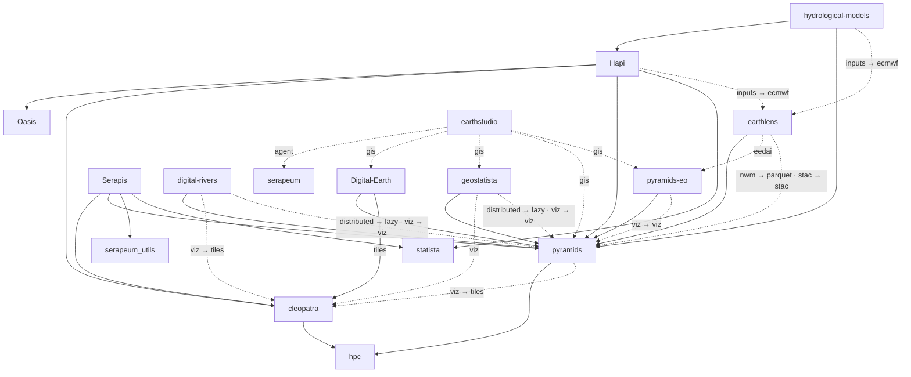

# Serapeum

Open-source Python for geospatial analysis, hydrological modelling and Earth observation.

Fourteen packages, all on [PyPI](https://pypi.org/) and [conda-forge](https://conda-forge.org/), built to
compose rather than to stand alone: a GDAL/OGR core, a plotting layer over it, and domain libraries built on
both. Use one on its own, or the whole stack together.

**[Documentation](https://serapeum-org.github.io/docs/)**

## Packages

### Geospatial

| Package | Distribution | What it does |
|---|---|---|
| [pyramids](https://github.com/serapeum-org/pyramids) | `pyramids-gis` | Raster, vector and datacube handling over GDAL/OGR — GeoTIFF, NetCDF, shapefiles, GeoJSON. The engine the rest of the stack builds on. |
| [pyramids-eo](https://github.com/serapeum-org/pyramids-eo) | `pyramids-eo` | Remote-sensing and Earth-observation tier on top of pyramids. |
| [digital-rivers](https://github.com/serapeum-org/digital-rivers) | `digital-rivers` | DEM and raster processing — the source of truth for terrain work across the stack. |
| [earthlens](https://github.com/serapeum-org/earthlens) | `earthlens` | Earth-observation data acquisition: ECMWF, STAC, Copernicus, GEE and more, behind one interface. |

### Hydrology

| Package | Distribution | What it does |
|---|---|---|
| [Hapi](https://github.com/serapeum-org/Hapi) | `hapi-nile` | Conceptual distributed hydrological model — HBV96 lumped model with Muskingum routing. |
| [Serapis](https://github.com/serapeum-org/Serapis) | `serapis` | Flood simulation and hydrodynamic modelling. |

### Visualization

| Package | Distribution | What it does |
|---|---|---|
| [cleopatra](https://github.com/serapeum-org/cleopatra) | `cleopatra` | A matplotlib convenience layer over in-memory NumPy data. Every other package plots through it. |
| [Digital-Earth](https://github.com/serapeum-org/Digital-Earth) | `digitalearth` | Geospatial visualization for rasters and vectors — static, interactive, 3D and web. |

### Statistics

| Package | Distribution | What it does |
|---|---|---|
| [statista](https://github.com/serapeum-org/statista) | `statista` | Statistics, with a focus on extreme-value analysis and distribution fitting. |
| [geostatista](https://github.com/serapeum-org/geostatista) | `geostatista` | Variograms, kriging and spatial autocorrelation. |

### Utilities

| Package | Distribution | What it does |
|---|---|---|
| [hpc](https://github.com/serapeum-org/hpc) | `hpc-utils` | NumPy helpers shared across the stack. |
| [unicloud](https://github.com/serapeum-org/unicloud) | `unicloud` | One interface over cloud object storage. |
| [Oasis](https://github.com/serapeum-org/Oasis) | `Oasis-Optimization` | Harmony-search optimization. |
| [serapeum_utils](https://github.com/serapeum-org/serapeum_utils) | `serapeum_utils` | Small shared utilities. |

### Other work

| Repository | What it is |
|---|---|
| [serapeum](https://github.com/serapeum-org/serapeum) | A provider-agnostic LLM framework — core plus pluggable providers. |
| [llama-utils](https://github.com/serapeum-org/llama-utils) | LlamaIndex utilities. |
| [github-actions](https://github.com/serapeum-org/github-actions) | Reusable composite actions every repository's CI is built from — Python setup for pip, uv and pixi, versioned MkDocs deploys, and releases. |
| [docs](https://github.com/serapeum-org/docs) | The documentation site that aggregates every package. |

## How the packages fit together

Derived from what each package declares in its `pyproject.toml`. The
[full graph](https://serapeum-org.github.io/docs/python-packages/dependency-graph/) in the documentation carries
the same links with more explanation.

<!-- dependency-graph:start -->

<!-- Generated by tools/dependency_graph.py from each package's pyproject.toml. Do not edit by hand. -->



Solid arrows are required dependencies; a label on one is the extra the dependency is installed with.
Dashed arrows are optional — the label reads `<extra on this package> → <extra on the dependency>`.
A dashed arrow beside a solid one is an extra that upgrades a dependency the package already requires.
Only runtime dependencies and installable extras are shown; contributor-only dependency groups are omitted.

12 further repositories neither depend on these packages nor are depended on by them, so they are not drawn here.

<!-- dependency-graph:end -->

## Installing

Every package is published to both PyPI and conda-forge:

```bash
pip install pyramids-gis
conda install -c conda-forge pyramids
```

Optional features ship as extras rather than as required dependencies, so a bare install stays small. Plotting is
the common case:

```bash
pip install "pyramids-gis[viz]"     # adds cleopatra and the plotting stack
pip install "hapi-nile[inputs]"     # adds earthlens with the ECMWF reader
```

## Contributing

Branches follow `<type>/<short-description>` in kebab-case, and commits follow
[Conventional Commits](https://www.conventionalcommits.org/). Releases are cut with Commitizen and flow on to PyPI
and conda-forge automatically.

- [Branch and pull request naming](https://serapeum-org.github.io/docs/development-tools/branch-naming-convention/)
- [Pre-commit hooks](https://serapeum-org.github.io/docs/development-tools/pre-commit/)

## Star History

[](https://star-history.com/#serapeum-org/Hapi&serapeum-org/pyramids&serapeum-org/earthlens&serapeum-org/statista&Date)
