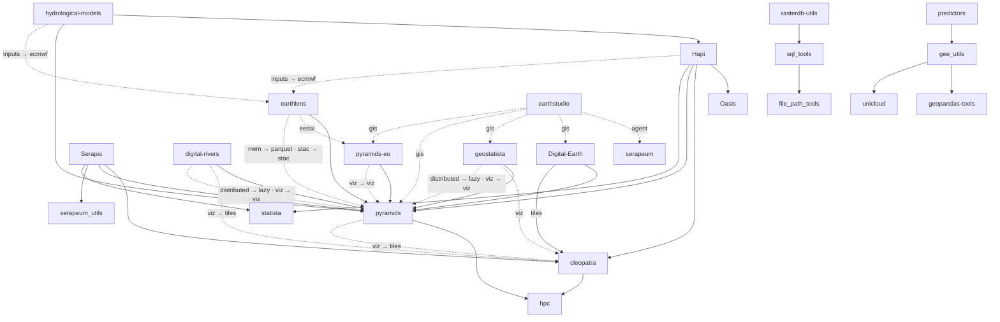

# Serapeum

[Documentations](https://serapieum-of-alex.github.io/docs/)

## How the packages fit together

<!-- dependency-graph:start -->

<!-- Generated by tools/dependency_graph.py from each package's pyproject.toml. Do not edit by hand. -->

Solid arrows are required dependencies; a label on one is the extra the dependency is installed with.
Dashed arrows are optional — the label reads `<extra on this package> → <extra on the dependency>`.
A dashed arrow beside a solid one is an extra that upgrades a dependency the package already requires.
Only runtime dependencies and installable extras are shown; contributor-only dependency groups are omitted.

11 further repositories neither depend on these packages nor are depended on by them, so they are not drawn here.

<!-- dependency-graph:end -->

## Star History

